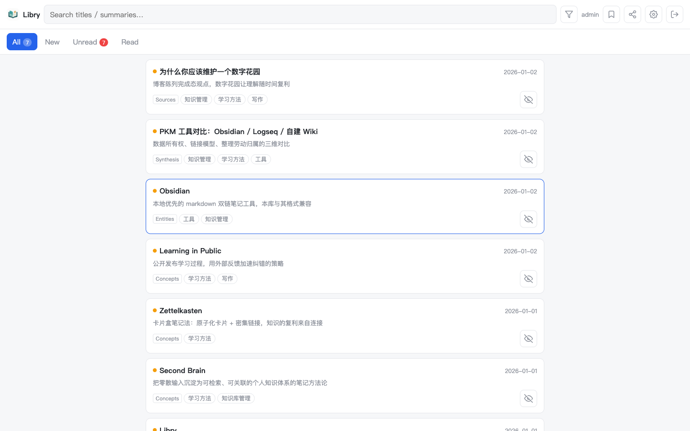
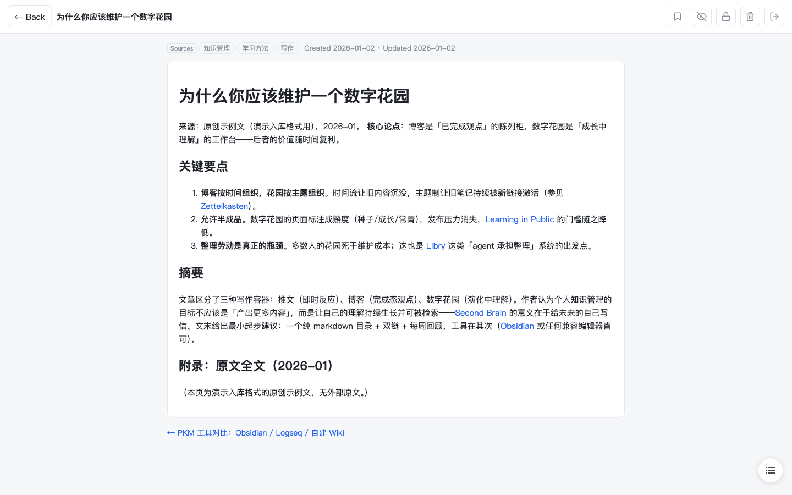
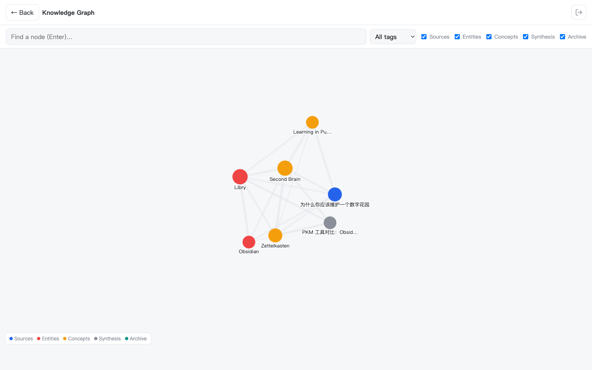
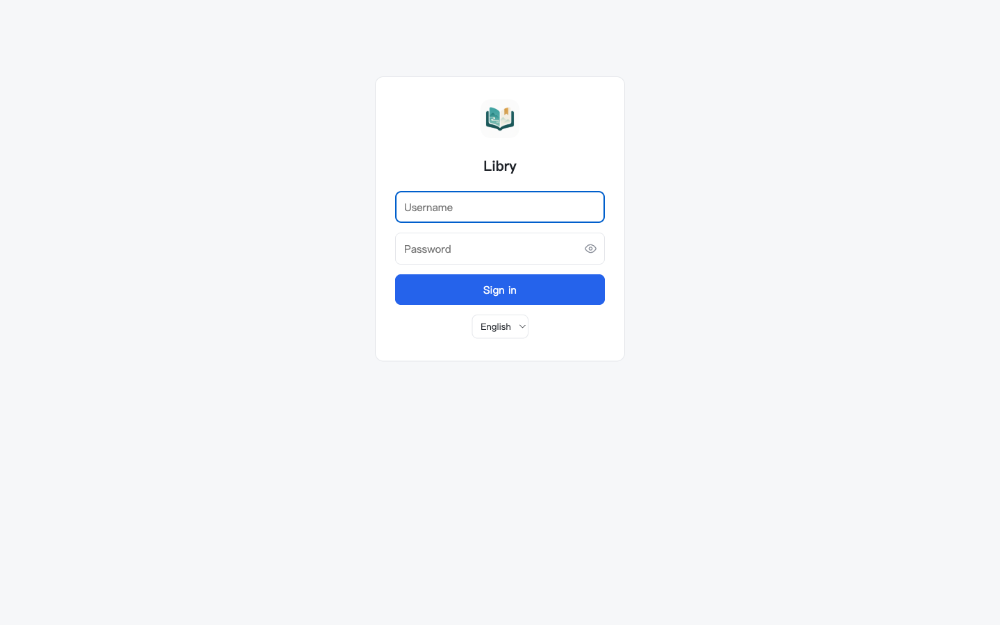

**English** · [简体中文](README.zh-CN.md)

# Libry（书阁）

**A personal knowledge base maintained by AI agents** — you read and decide; agents ingest, organize, and health-check.

Libry is an open-source second-brain system you can run locally or on your own server:

- **Engine and content are separated** — the knowledge base (vault) is a plain markdown directory (Obsidian-compatible), so your data is never locked in. The engine is a small Python package (FastAPI + Vue 3, no frontend build step).
- **Agents act as librarians** — the vault ships with an `AGENTS.md` contract and `.agents/skills/` (kb-ingest / kb-lint / kb-publish / kb-query). Any coding agent (Claude Code, hermes, ZCode, Codex…) can pick it up and start working; cron jobs make ingestion and linting fully automatic.
- **Built for reading** — multiple accounts, read/unread tracking, reading-progress memory with a "continue reading" card, favorites plus position bookmarks, per-document personal/shared visibility, an embedding-based relation graph (optional component), and two-node git sync.
- **Minimal deployment** — one `libry init` command scaffolds everything; `deploy/install.sh` sets up bare-metal service (systemd / launchd + Caddy templates). Docker support is on the roadmap (v0.2+).

<p align="center">
  <a href="#screenshots"></a>
  &nbsp;&nbsp;
  <a href="#screenshots"></a>
  &nbsp;&nbsp;
  <a href="#screenshots"></a>
</p>

---

## Quickstart

**Requirements**: Python 3.11+, git.

```bash
# 1. Install the engine
git clone https://github.com/CobyLee66/Libry.git ~/Libry
cd ~/Libry && python3.11 -m venv .venv && .venv/bin/pip install .

# 2. Create your knowledge base (interactively sets the admin password; --no-git skips git init)
.venv/bin/libry init ~/my-kb --title "My Knowledge Base"

# 3. Start
cd ~/my-kb && ~/Libry/.venv/bin/libry serve
# → http://127.0.0.1:8000
```

Put an AI agent in charge (open your coding agent in the vault directory, or hand material to it directly):

```bash
cd ~/my-kb
claude "Ingest this article per AGENTS.md: https://example.com/article"
```

Server deployment / auto-start / relation graph / multi-node sync: see the docs linked below.

---

## Screenshots

Captured against a **demo vault** created by `libry init` — the sample content is original demo material; nothing from a real knowledge base is ever photographed.

| | |
|:---:|:---:|
| **Library** — document list with read/new tracking, tag badges, full-text search and visibility toggles; the UI follows your browser language (中文 / English) | **Reader** — wikilinks rendered inline, tag and date metadata, backlinks; documents are plain markdown under the hood |
|  |  |
| **Knowledge graph** — every page as a node, colored by type (sources / entities / concepts / synthesis); edges blend wikilink, tag and source signals with local embeddings (`libry graph`, optional) into a 0–1 relatedness score — zoom, drag, filter by type/tag, click a node to open it | **Sign in** — multi-account with per-document personal/shared visibility; personal documents are indistinguishable from 404 for everyone else |
|  |  |

---

## How it works

```
┌────────────────── vault (your knowledge base: plain markdown + git) ──────────────────┐
│  AGENTS.md (agent contract)   .agents/skills/ (kb-ingest/lint/publish/query)          │
│  wiki/{sources,entities,concepts,synthesis}/   index.md   tags.md   wiki/log.md       │
│  content_dirs (notes/…, archived originals)   raw/assets/ (images)   .libry/ (state)  │
└───────────────▲───────────────────────────────────────────────▲───────────────────────┘
                │ read/write                                    │ git sync (optional multi-node)
┌───────────────┴──────────────┐                    ┌───────────┴──────────┐
│  Libry engine (this repo)    │                    │  The other node       │
│  libry serve  FastAPI+Vue    │◀── webhook/cron ──▶│  (VPS/laptop)         │
│  libry index/graph/purge     │                    │  read-only + merge    │
│  libry lint (tools/lint ×7)  │                    │  CRDT LWW + tombstones│
└──────────────────────────────┘                    └──────────────────────┘
         ▲
         │ KB_AGENT_CMD (any coding agent, headless)
  scheduled ingest / lint / notify (scripts/)
```

- **Ingestion**: the agent follows the `AGENTS.md` workflow to produce source pages (summary first, full original text appended), update entity/concept pages, maintain index/tags/log, then publishes via `kb-publish`.
- **Health checks**: `libry lint` runs 7 structural checks (broken wikilinks, orphan pages, index consistency, frontmatter, dead links, source reachability, render pipeline).
- **Deletion**: mark in the web UI → `libry purge` mechanically cleans up (deletes files, converts wikilinks to plain text, removes index lines, appends to the log), with tombstones preventing resurrection across nodes.

---

## CLI

```
libry init [PATH]        Scaffold a vault (template + random secrets in .env + admin password + git)
libry serve              Start the web service (reads the vault's .env)
libry index / graph      Rebuild the index / relation graph (graph needs pip install 'libry[graph]')
libry lint               Structural health checks (7 checks)
libry purge [--dry-run]  Execute pending deletions (the executor half of mark-and-purge)
libry sync-data          Multi-node user-data sync (CRDT merge)
libry passwd [USER]      Set/change an account password
libry skills update      Sync the latest agent skills into the vault after an engine upgrade
libry config             Print resolved config (engine_root / kb_root / content_dirs)
```

Configuration: `libry.toml` at the vault root (title, content_dirs) + environment variables (`KB_ROOT`, `KB_DATA_DIR`, `KB_ROLE`, `KB_GIT_BRANCH`, `KB_LOCAL_URL`, `KB_DEPLOY_KEY`, etc. — see the header comments of each script and the docs).

---

## Documentation

| Topic | File |
|---|---|
| Architecture & data flow | [docs/architecture.md](docs/architecture.md) |
| Bare-metal deployment (Ubuntu VPS from scratch / macOS) | [docs/deploy-bare.md](docs/deploy-bare.md) |
| Agent integration (any coding agent + cron) | [docs/agent-integration.md](docs/agent-integration.md) |
| Multi-node sync (Mac + VPS) | [docs/multi-node-sync.md](docs/multi-node-sync.md) |
| Vault maintenance rules (full agent contract) | `AGENTS.md` inside the vault (generated by `libry init`) |
| Engine development rules (required reading for contributors/agents) | [AGENTS.md](AGENTS.md) |
| Frontend style guide | [docs/frontend-style.md](docs/frontend-style.md) |
| API reference | [docs/api.md](docs/api.md) |

*(Design documents under `docs/` are currently written in Chinese.)*

---

## Security model

- Sessions: itsdangerous-signed cookies (7 days) + bcrypt password hashing; rate limiting on login and sync endpoints.
- Rendering: nh3 whitelist sanitization (the stored-XSS defense) + Caddy CSP template.
- Personal documents: visible only to the owner and admins; indistinguishable from 404 for everyone else.
- Secrets live only in the vault-root `.env` (gitignored, randomly generated by `libry init`).
- Report vulnerabilities via [SECURITY.md](SECURITY.md).

## Roadmap

- [ ] v0.2: Docker (containerize only the web read side; the git/agent toolchain stays on the host)
- [ ] v0.2+: FTS5 full-text search (content.json is already prepared), PyPI release
- [ ] Issues and PRs welcome: [CONTRIBUTING.md](CONTRIBUTING.md)

## License

[MIT](LICENSE) © 2026 CobyLee66
